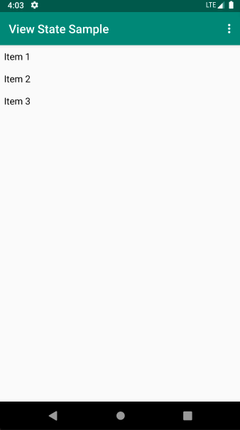

## ViewState

[](https://jitpack.io/#wizeline/android-viewstate)

ViewState is an Android user interface element that can be used to hold a simple child with content, this element can be used to give visual feedback to the users, for instance it can be used to notify about the state of a network request.



## Sample Project

To run the `View State Sample` project:

1. Clone the repo with the following command:

    `git clone git@github.com:wizeline/WL-Android-ViewState.git`

2. Import the project using Android Studio

    `Run the app `

## Download

Gradle
```
allprojects {
    repositories {
      maven { url 'https://jitpack.io' }
    }
}
```

```
dependencies {
    implementation 'com.github.wizeline:android-viewstate:1.0'
}
```

## Usage

#### XML

```xml
<com.wizeline.viewstate.ViewState 
    xmlns:android="http://schemas.android.com/apk/res/android"
    xmlns:app="http://schemas.android.com/apk/res-auto"
    android:id="@+id/viewState"
    android:layout_width="match_parent"
    android:layout_height="match_parent"
    app:loadingTitleText="Custom text"
    app:emptyImageResource="@drawable/your_image"
    app:emptyTitleText="Custom text"
    app:emptyDescriptionText="Custom text"
    app:errorImageResource="@drawable/your_image"
    app:errorTitleText="Custom text"
    app:errorDescriptionText="Custom text">
   
        <!--  Put your content here  -->

</com.wizeline.viewstate.ViewState>
```

#### Code

Method | Description
--- | ---
`viewState.setState(state)` | Sets the state type
`viewState.setLoadingTitleText(title)` | Sets the loading title text
`viewState.setEmptyImageResource(resId)` | Sets the empty image using a local resource
`viewState.setEmptyTitleText(title)` | Sets the empty title text
`viewState.setEmptyDescriptionText(description)` | Sets the empty description text
`viewState.setErrorImageResource(resId)` | Sets the error image using a local resource
`viewState.setErrorTitleText(title)` | Sets the error title text
`viewState.setErrorDescriptionText(description)` | Sets the error description text
`viewState.setErrorRetryText(buttonText)` | Sets the error button text
`viewState.setOnRetryClickListener { Code here }` | Sets the error button listener

## Customize

#### Overwriting layouts

If there's a need to have a custom layout, you can overwrite these three layouts

`view_state_empty.xml`
```xml
<?xml version="1.0" encoding="utf-8"?>
<LinearLayout xmlns:android="http://schemas.android.com/apk/res/android"
    android:layout_width="match_parent"
    android:layout_height="match_parent"
    android:gravity="center"
    android:orientation="vertical">

    <ImageView
        android:id="@+id/emptyImage"
        android:layout_width="@dimen/empty_state_image_size"
        android:layout_height="@dimen/empty_state_image_size"
        android:contentDescription="@null"
        android:src="@drawable/ic_list"
        android:layout_marginBottom="@dimen/offset_small"/>

    <TextView
        android:id="@+id/emptyTitle"
        android:layout_width="@dimen/empty_state_text_width"
        android:layout_height="wrap_content"
        android:gravity="center"
        android:text="@string/empty_state_empty_title"
        android:textColor="@android:color/black"
        android:textSize="20sp"
        android:textStyle="bold" />

    <TextView
        android:id="@+id/emptyDescription"
        android:layout_width="@dimen/empty_state_text_width"
        android:textSize="16sp"
        android:gravity="center"
        android:layout_height="wrap_content"
        android:layout_marginBottom="@dimen/offset_small"
        android:text="@string/empty_state_empty_description" />

</LinearLayout>
```

`view_state_error.xml`

```xml
<?xml version="1.0" encoding="utf-8"?>
<LinearLayout xmlns:android="http://schemas.android.com/apk/res/android"
    android:layout_width="match_parent"
    android:layout_height="match_parent"
    android:gravity="center"
    android:orientation="vertical">

    <ImageView
        android:id="@+id/errorImage"
        android:layout_width="@dimen/empty_state_image_size"
        android:layout_height="@dimen/empty_state_image_size"
        android:contentDescription="@null"
        android:src="@drawable/ic_wifi"
        android:layout_marginBottom="@dimen/offset_small"/>

    <TextView
        android:id="@+id/errorTitle"
        android:layout_width="@dimen/empty_state_text_width"
        android:layout_height="wrap_content"
        android:gravity="center"
        android:text="@string/empty_state_error_title"
        android:textColor="@android:color/black"
        android:textSize="20sp"
        android:textStyle="bold" />

    <TextView
        android:id="@+id/errorDescription"
        android:layout_width="@dimen/empty_state_text_width"
        android:textSize="16sp"
        android:gravity="center"
        android:layout_height="wrap_content"
        android:layout_marginBottom="@dimen/offset_small"
        android:text="@string/empty_state_error_description" />

    <Button
        android:id="@+id/errorRetry"
        style="@android:style/Widget.Material.Button.Borderless.Colored"
        android:layout_width="wrap_content"
        android:layout_height="wrap_content"
        android:text="@string/empty_state_error_retry"
        android:textAllCaps="true"
        android:textStyle="bold" />

</LinearLayout>
```

`view_state_loading.xml`
```xml
<?xml version="1.0" encoding="utf-8"?>
<LinearLayout xmlns:android="http://schemas.android.com/apk/res/android"
    android:layout_width="match_parent"
    android:layout_height="match_parent"
    android:gravity="center"
    android:orientation="vertical">

    <ProgressBar
        android:id="@+id/loadingProgressBar"
        style="@android:style/Widget.DeviceDefault.Light.ProgressBar"
        android:layout_width="wrap_content"
        android:layout_height="wrap_content"
        android:layout_marginBottom="@dimen/offset_medium" />

    <TextView
        android:id="@+id/loadingTitle"
        android:layout_width="@dimen/empty_state_text_width"
        android:layout_height="wrap_content"
        android:gravity="center"
        android:text="@string/empty_state_loading"
        android:textColor="@android:color/black"
        android:textSize="20sp"
        android:textStyle="bold" />

</LinearLayout>
```


## Contributing to ViewState

We actively welcome your pull requests. We are trying to make contributions to this project as transparent and accessible as possible, please read our [Contributing guidelines](CONTRIBUTING.md) and follow the [Code of conduct](CODE_OF_CONDUCT.md).
If you face any problem with the code, please open an issue on GitHub.

List of [Contributors](https://github.com/wizeline/WL-Android-ViewState/graphs/contributors).️

## License
```
Copyright 2019 Wizeline

Licensed under the Apache License, Version 2.0 (the "License");
you may not use this file except in compliance with the License.
You may obtain a copy of the License at

   http://www.apache.org/licenses/LICENSE-2.0

Unless required by applicable law or agreed to in writing, software
distributed under the License is distributed on an "AS IS" BASIS,
WITHOUT WARRANTIES OR CONDITIONS OF ANY KIND, either express or implied.
See the License for the specific language governing permissions and
limitations under the License.
```